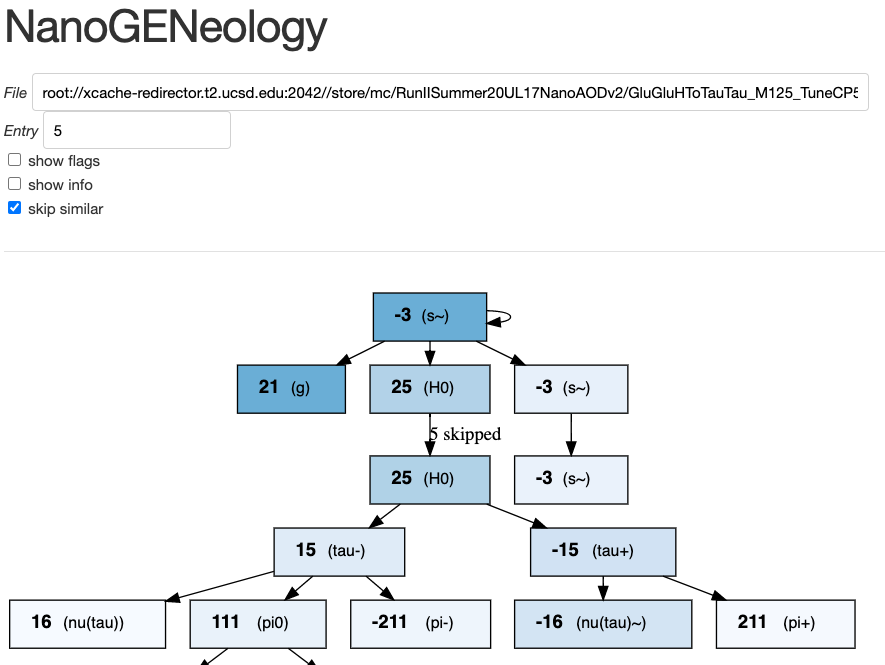
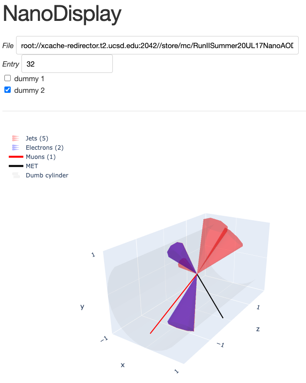
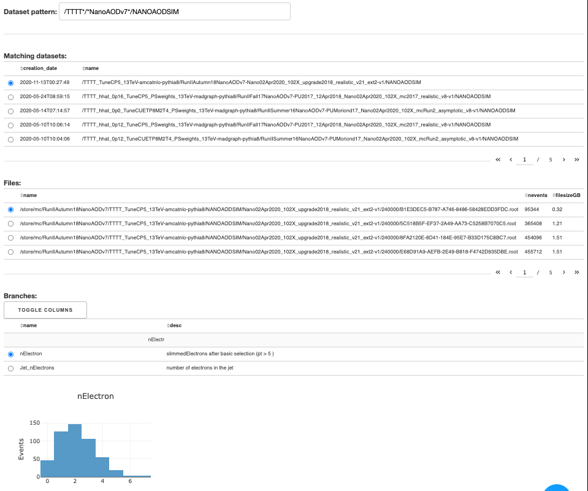

# Dashboards

A conda environment with `uproot`, `plotly`, `dash`, ...
is needed for these dashboards. See below for instructions on setting
up the environment and enabling it.

## NanoGENeology

This dashboard summarizes the generator-level particle
record for a given event in NanoAOD. Similar particles (e.g.,
same particle but going through a chain of radiation and getting
different Pythia status codes) can be suppressed.
Information like pT, eta, phi, mass, and Pythia status flags
can be included in the diagram as well.

### Usage

In a conda environment on a uaf machine...
```
python nanogentree.py
# take note of the port that is printed out
# edit the variables below and execute the `ssh` command on your local computer
port=11337
host=uaf-10.t2.ucsd.edu
ssh -N -f -L localhost:$port:localhost:$port $host
# visit http://localhost:11337/nanogentree/ in your browser
```

### Preview


## NanoDisplay

Similar to `NanoGENeology` in terms of inputs, but
shows a simple event display of reco `Jet`, `Electron`,
`Muon`, and `MET` objects. Only directions are meaningful
because `plotly` has a mind of its own for the cone normalization, etc.

### Usage

In a conda environment on a uaf machine...
```
python nanodisplay.py
# take note of the port that is printed out
# edit the variables below and execute the `ssh` command on your local computer
port=11339
host=uaf-10.t2.ucsd.edu
ssh -N -f -L localhost:$port:localhost:$port $host
# visit http://localhost:11339/nanodisplay/ in your browser
```

### Preview



## NanoExplorer

This dashboard lets you enter a dataset pattern, then
shows a list of matching dataset names. Select a dataset to see
the files. Select a file to see the branches. Filter the branches and
select a branch to plot a 1D histogram of it.

### Usage

In a conda environment on a uaf machine...
```
python nanoexplorer.py
# take note of the port that is printed out
# edit the variables below and execute the `ssh` command on your local computer
port=11338
host=uaf-10.t2.ucsd.edu
ssh -N -f -L localhost:$port:localhost:$port $host
# visit http://localhost:11338/nanoexplorer/ in your browser
```

### Preview


## Conda environment

You only have to do the initial setup once. Afterwards, 
you only need to activate the environment.

### Initial setup

Install after a fresh login to the computers (to prevent CMSSW interference).
```bash
# download conda installer
curl -O -L https://repo.anaconda.com/miniconda/Miniconda3-latest-Linux-x86_64.sh
bash Miniconda3-latest-Linux-x86_64.sh -b 

# add conda to the end of ~/.bashrc, so relogin after executing this line
~/miniconda3/bin/conda init

# stop conda from activating the base environment on login
conda config --set auto_activate_base false
conda config --add channels conda-forge

# create environments with as much stuff from anaconda
conda create --name analysisenv uproot pandas matplotlib jupyter numba graphviz scipy iminuit uproot3 awkward

# and then any install residual packages with pip
conda run --name analysisenv pip install yahist particle graphviz pydot dash plotly
```

### Activate and use

```bash
conda activate analysisenv
python script.py
```
